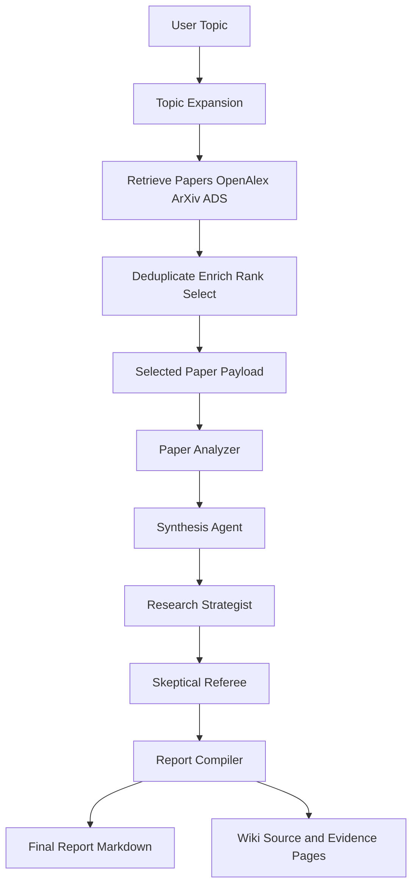
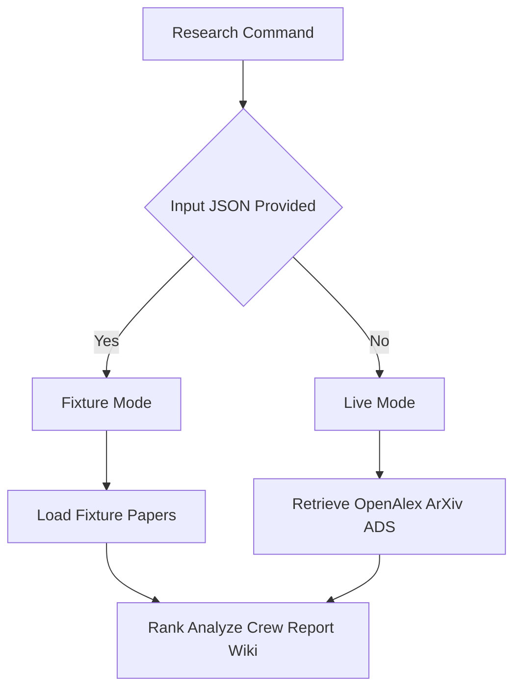

# Astro Research Assistant (CrewAI)

Python project for an astrophysics/cosmology/astronomy research assistant built with CrewAI.


## Project Goal

Build a multi-agent research workflow that can:
- discover and retrieve relevant papers,
- normalize metadata from trusted sources,
- analyze and synthesize findings into structured outputs,
- maintain an evolving research wiki and reports.

## Current Status

- Project scaffold is in place.
- Core Pydantic schemas are implemented.
- Retrieval and enrichment tools are implemented for OpenAlex, arXiv, NASA ADS, and Semantic Scholar.
- Metadata deduplication, deterministic ranking, PDF handling, and wiki source-page tooling are implemented.
- Agent scaffolds and prompt files are implemented for topic expansion, paper analysis, synthesis, hypothesis generation, skeptical review, and report compilation.
- A sequential CrewAI research pipeline is implemented in `crews/research_crew.py` and is ready to consume pre-selected papers from app/CLI.

## Quick Start (New User)

### 1) Prerequisites

- Python `3.12+`
- [`uv`](https://docs.astral.sh/uv/getting-started/installation/)

### 2) Install dependencies

```bash
uv sync
```

### 3) Configure environment

Create `.env` in the repo root:

```bash
OPENALEX_MAILTO=your_email@example.com
NASA_ADS_API_KEY=...
SEMANTIC_SCHOLAR_API_KEY=...
OPENAI_API_KEY=...
BRAVE_SEARCH_API_KEY=...
```

Minimum recommended for first live run:
- `OPENALEX_MAILTO`
- `OPENAI_API_KEY`

### 4) Run your first research command

Live retrieval (recommended real run):

```bash
uv run python main.py research "Dark Energy evolution over time" --max-papers 5
```

Offline deterministic run (no external retrieval APIs):

```bash
uv run python main.py research "Dark Energy evolution over time" --max-papers 5 --input-json evals/fixture_papers_dark_energy.json
```

### 5) Where outputs go

- Report markdown: `reports/<topic-slug>.md`
- Wiki source pages: `storage/wiki/sources/`
- Wiki index/log: `storage/wiki/index.md`, `storage/wiki/log.md`

If you only want to see CLI options:

```bash
uv run python main.py research --help
```

## Repository Layout

High-level directories:

- `app/`: app-level config and CLI entry scaffolding.
- `agents/`: future CrewAI agent implementations.
- `crews/`: future crew orchestration.
- `tools/`: retrieval, enrichment, ranking, PDF, and wiki tooling.
- `schemas/`: Pydantic models for paper metadata and analysis/report structures.
- `storage/raw/`: source artifacts (papers, metadata, bibtex).
- `storage/wiki/`: generated wiki artifacts (`sources/`, `index.md`, `log.md`).
- `tests/`: unit and integration tests.

## Implemented Modules

### Schemas

- `schemas/paper.py`
  - `PaperIdentity`, `CitationCounts`, `PaperMetadata`, `PaperCandidate`, `RankedPaper`
  - supports DOI/arXiv/ADS/OpenAlex/S2 IDs and multi-source citation counts.
- `schemas/paper_analysis.py`
  - `PaperAnalysis` with astrophysics fields (observables, datasets, instruments, missions, parameters, redshift, wavelength, systematics, methods, limitations, open questions).
- `schemas/hypothesis.py`, `schemas/synthesis.py`, `schemas/report.py`
  - structured outputs for hypothesis generation, synthesis, and final report packaging.
- `schemas/topic_expansion.py`
  - `TopicExpansion` schema for canonical queries, aliases, observables, surveys, parameters, systematics, subfields, and arXiv categories.
- `schemas/paper_analysis.py`, `schemas/hypothesis.py`, and `schemas/synthesis.py` include extended fields aligned to current agent outputs.

### Tools

- `tools/openalex_tool.py`
  - `search_openalex_works(query, max_results, sort)`
  - reconstructs abstract from OpenAlex inverted index and maps to `PaperMetadata`.
- `tools/arxiv_tool.py`
  - `search_arxiv_papers(query, max_results)`
  - includes astro-ph-aware query fallback strategy.
- `tools/ads_tool.py`
  - `search_ads_papers(query, max_results)`
  - requires `NASA_ADS_API_KEY`.
- `tools/semantic_scholar_tool.py`
  - `enrich_paper_with_semantic_scholar(paper)`
  - DOI -> arXiv -> title fallback, non-destructive merge behavior.
- `tools/metadata_resolver.py`
  - `deduplicate_papers(papers)`
  - merges by IDs first, then fuzzy title fallback when IDs are missing.
- `tools/ranking_tool.py`
  - `rank_papers(papers, topic, current_year)`
  - `select_canonical_papers(...)`
  - `select_recent_high_signal_papers(...)`
  - deterministic scoring with paper-type multipliers.
- `tools/pdf_tool.py`
  - `download_pdf(paper, output_dir)`
  - `extract_text_from_pdf(path, max_pages)`
  - PyMuPDF-first extraction with pdfplumber fallback.
- `tools/wiki_tool.py`
  - `create_source_page(...)`, `write_source_page(...)`, `update_index(...)`, `append_log(...)`, `slugify_title(...)`
  - writes source pages under `storage/wiki/sources/` with YAML frontmatter and Obsidian-style links.
  - updates evidence pages under `storage/wiki/concepts/`, `storage/wiki/datasets/`, `storage/wiki/parameters/`, and `storage/wiki/methods/`.

### Agents and Crew

- Prompt files:
  - `prompts/topic_expansion.md`
  - `prompts/paper_analysis.md`
  - `prompts/synthesis.md`
  - `prompts/hypothesis_generation.md`
  - `prompts/skeptical_review.md`
  - `prompts/report_compilation.md`
- Agent scaffolds:
  - `agents/topic_expander.py`
  - `agents/paper_analyzer.py`
  - `agents/synthesis_agent.py`
  - `agents/research_strategist.py`
  - `agents/skeptical_referee.py`
  - `agents/report_compiler.py`
- What each agent does:
  - `topic_expander`: expands a user topic into retrieval-oriented queries, aliases, observables, surveys, parameters, and systematics.
  - `paper_analyzer`: converts each selected paper into structured `PaperAnalysis` fields (question, methods, datasets, constraints, systematics, limitations).
  - `synthesis_agent`: aggregates multiple paper analyses into a field-level synthesis (consensus, tensions, recurring weaknesses, open problems).
  - `research_strategist`: proposes concrete, testable research hypotheses grounded in extracted evidence.
  - `skeptical_referee`: critiques and re-labels hypotheses (`validated`/`plausible`/`rejected`) based on explicit evidence and falsifiability.
  - `report_compiler`: assembles the final narrative report from analyses, synthesis, and labeled hypotheses.
- Crew orchestration:
  - `crews/research_crew.py` exposes `build_research_crew(llm) -> Crew`
  - Uses `Process.sequential` with tasks:
    1. analyze selected papers
    2. synthesize field
    3. generate hypotheses
    4. critique hypotheses
    5. compile report
  - Data flow (high level):
    1. CLI retrieves/ranks papers (outside crew).
    2. Crew analyzes selected papers.
    3. Crew synthesizes cross-paper findings.
    4. Crew generates and critiques hypotheses.
    5. Crew compiles the final report text.
  - Visual flow:



  - Paper retrieval/ranking/download is intentionally outside the crew (to be handled by app/CLI before kickoff).

### Ontology

- `ontology/parameters.yaml`:
  - core parameter entries (e.g. `S8`, `H0`, `Omega_m`, `sigma8`).
- `ontology/surveys_and_missions.yaml`:
  - survey/mission metadata (e.g. Planck, DES, KiDS, HSC, DESI, JWST).
- `ontology/systematics.yaml`:
  - probe-specific systematic effects (weak lensing, CMB, high-z galaxies).
- `ontology/cosmology_topics.yaml`:
  - populated topic ontology (Hubble tension, S8 tension, dark energy evolution, inflation, neutrino cosmology, LSS, modified gravity, reionization, etc.).
- `ontology/observables.yaml`:
  - populated observable ontology (CMB TT/EE, CMB lensing, BAO, RSD, SN Ia, cosmic shear, galaxy clustering, cluster counts, standard sirens, Ly-alpha forest, 21cm).

## Environment Variables

Create a local `.env` file:

```bash
OPENALEX_MAILTO=your_email@example.com
NASA_ADS_API_KEY=...
SEMANTIC_SCHOLAR_API_KEY=...
OPENAI_API_KEY=...
BRAVE_SEARCH_API_KEY=...
```

Notes:
- `NASA_ADS_API_KEY` is required for ADS queries.
- Semantic Scholar can run without an API key, but keyless calls are rate-limited.
- `BRAVE_SEARCH_API_KEY` is optional and only needed for `--web-expand`.
- `.env` is gitignored and should never be committed.

## Tool Smoke Tests

Run each tool directly from the repo root:

```bash
uv run python tools/openalex_tool.py "S8 tension weak lensing Planck" --max-results 5
uv run python tools/arxiv_tool.py "S8 tension weak lensing Planck" --max-results 5
uv run python tools/ads_tool.py "S8 tension weak lensing Planck" --max-results 5
S2_DEBUG=1 uv run python tools/semantic_scholar_tool.py
```

Offline fixture mode (no live retrieval APIs):

```bash
python main.py research "S8 tension between weak lensing and Planck" --max-papers 10 --input-json evals/fixture_papers_s8.json
```

Fixture JSON format:

```json
{
  "papers": [
    {
      "title": "KiDS-450 cosmological constraints",
      "year": 2017,
      "doi": "10.1093/mnras/stw2805",
      "arxiv_id": "1606.05338",
      "abstract": "..."
    }
  ],
  "extracted_text_by_key": {
    "10.1093/mnras/stw2805": "optional extracted text override"
  }
}
```

Notes:
- You can also provide a bare JSON list of paper objects.
- `extracted_text_by_key` is optional and keyed by DOI/arXiv/ADS/OpenAlex/title key used by the CLI.
- In fixture mode, retrieval APIs are bypassed to validate payload, Crew context, and report/wiki flow offline.
- A ready-to-run fixture is included at `evals/fixture_papers_s8.json`.
- A second ready-to-run fixture is included at `evals/fixture_papers_jwst_highz.json`.
- A third ready-to-run fixture is included at `evals/fixture_papers_dark_energy.json`.
- By default, fixture mode now validates topic/fixture relevance and exits early on obvious mismatch. Override with `--no-strict-fixture-topic-match` only when intentionally reusing a fixture across topics.

### Fixture Workflow (Important)

`--input-json` is intentionally strict and should be treated as an "offline evidence lock":

- The topic string can change, but the paper evidence will only come from the fixture file.
- No OpenAlex/arXiv/ADS retrieval runs when fixture mode is active.
- Ranking and report generation are still executed, but only over fixture papers.

This means topic/fixture mismatch can produce scientifically incoherent reports unless guarded.

#### Topic/Fixture mismatch guard

When fixture mode is enabled, the CLI computes a lightweight keyword-overlap check between:
- your requested topic
- fixture paper titles/abstracts

If overlap is too low, the run exits with a clear error and suggestions.

Example mismatch:

```bash
uv run python main.py research "Massive high z galaxies from the JWST" --max-papers 5 --input-json evals/fixture_papers_s8.json
```

Expected behavior: exits early with a fixture/topic mismatch message.

To intentionally bypass guardrails (advanced/debug use only):

```bash
uv run python main.py research "Massive high z galaxies from the JWST" --max-papers 5 --input-json evals/fixture_papers_s8.json --no-strict-fixture-topic-match
```

#### Recommended fixture commands

S8 fixture:

```bash
uv run python main.py research "S8 tension between weak lensing and Planck" --max-papers 5 --input-json evals/fixture_papers_s8.json
```

JWST high-z fixture:

```bash
uv run python main.py research "Massive high z galaxies from the JWST" --max-papers 5 --input-json evals/fixture_papers_jwst_highz.json
```

Dark-energy fixture:

```bash
uv run python main.py research "Dark Energy evolution over time" --max-papers 5 --input-json evals/fixture_papers_dark_energy.json
```

#### Choosing live mode vs fixture mode

Use fixture mode when you need reproducible offline debugging for:
- payload shaping,
- schema parsing,
- report rendering,
- wiki update behavior.

Use live mode (omit `--input-json`) when you want topic-true retrieval and discovery:

```bash
uv run python main.py research "Massive high z galaxies from the JWST" --max-papers 10
```

Mode branch (high level):



### Live Retrieval Controls

To reduce arXiv rate-limit failures in live mode, the CLI now supports three controls:

- arXiv query fanout is intentionally limited to the first canonical query (lower burst pressure).
- arXiv requests use retry + exponential backoff on HTTP 429 behavior.
- Source selection flags allow explicit control over retrieval providers.

Examples:

Skip arXiv entirely:

```bash
uv run python main.py research "Massive high z galaxies from the JWST" --max-papers 10 --skip-arxiv
```

Use only OpenAlex + ADS (exclude arXiv):

```bash
uv run python main.py research "Massive high z galaxies from the JWST" --max-papers 10 --sources openalex,ads
```

Use only arXiv:

```bash
uv run python main.py research "Massive high z galaxies from the JWST" --max-papers 10 --sources arxiv
```

Notes:
- `--sources` applies to live mode only (fixture mode bypasses external retrieval).
- Valid source values: `openalex`, `arxiv`, `ads`.
- `--skip-arxiv` takes precedence over including `arxiv` in `--sources`.
- Fixture papers can include enriched IDs (`doi`, `openalex_id`, `semantic_scholar_id`) and `citation_counts` for more realistic ranking/report behavior.

### Web-Assisted Topic Expansion

You can optionally add a web discovery layer before retrieval:

```bash
uv run python main.py research "Massive high z galaxies from the JWST" --max-papers 10 --web-expand
```

Behavior:
- ontology/rule expansion runs first,
- optional Brave-based web expansion discovers extra vocabulary (surveys, instruments, systematics, phrase-level query terms),
- merged expansion drives retrieval query generation,
- ranking remains deterministic and local (web results are discovery hints, not ranking authority).

If `BRAVE_SEARCH_API_KEY` is missing or web calls fail, the run continues with deterministic expansion.

Dark-energy runs now also include deterministic topic-expansion templates (`w0`, `wa`, CPL, BAO/SNe/CMB combos, Pantheon+/DESI/eBOSS terms) so expansion is not generic for `Dark Energy evolution over time`.

Wiki smoke script:

```bash
uv run python scripts/test_wiki_tool.py
```

Idempotency check (run twice):

```bash
uv run python scripts/test_wiki_tool.py
uv run python scripts/test_wiki_tool.py
```

Expected behavior: evidence bullets are not duplicated when the same source/analysis is written repeatedly.

## Tests

Run all unit tests:

```bash
uv run pytest -q
```

Run targeted suites:

```bash
uv run pytest tests/test_metadata_resolver.py -q
uv run pytest tests/test_ranking_tool.py -q
uv run pytest tests/test_pdf_tool.py -q
uv run pytest tests/test_wiki_tool.py -q
uv run pytest tests/test_retrieval_tools.py -q
```

Run a single test:

```bash
uv run pytest tests/test_pdf_tool.py::test_download_pdf_skips_when_file_exists -q
```

Integration marker:

```bash
uv run pytest -m integration -q
```

## Deterministic Ranking Summary

`rank_papers` now combines:
- relevance score: weighted topic-phrase relevance (topic-specific terms + penalties),
- citation score: log-normalized selected citation count,
- source confidence score: deterministic metadata-confidence signal,
- recency score: deterministic age-decay,
- paper-type multiplier: review downweight; selected observational/data/method classes upweight.

Canonical scoring blend:
- `0.50 * relevance + 0.25 * citation + 0.15 * source_confidence + 0.10 * recency`

Recent high-signal scoring blend:
- `0.50 * relevance + 0.25 * recency + 0.15 * velocity + 0.10 * citation`

For JWST/high-z-style topics, explicit negative terms (e.g. axion/biology-style drift) are penalized in relevance scoring.
For dark-energy topics, non-cosmology GW discovery papers (e.g. GW150914 binary-black-hole discovery without standard-siren/dark-energy context) receive strong negative relevance penalties.

Canonical selection now applies an additional relevance gate for dark-energy topics to reduce citation-dominated off-topic picks.

Paper-type multipliers:
- `review` x `0.85`
- `survey_data_release`, `methodology`, `observational_constraint` x `1.05`

## Wiki Output Behavior

- Source pages are written to `storage/wiki/sources/<slug>.md`.
- Source page frontmatter currently uses `updated_at` (MVP behavior) and rewrites the page on updates.
- `storage/wiki/index.md` is updated with Obsidian links.
- `storage/wiki/log.md` receives timestamped append-only events.
- Evidence pages are updated under:
  - `storage/wiki/concepts/`
  - `storage/wiki/datasets/`
  - `storage/wiki/parameters/`
  - `storage/wiki/methods/`
- Evidence pages use YAML frontmatter (`page_type`, `title`) and keep an `## Evidence from sources` section.
- Legacy evidence pages are auto-upgraded to frontmatter format the next time they are updated.
- Evidence entries are append-only and deduplicated per source bullet.

## Recent Updates

- Strengthened Crew task contracts in `crews/research_crew.py` to request strict JSON for:
  - paper analysis extraction (`paper_analyses`)
  - hypothesis generation (`hypotheses`)
  - skeptical review output (status-corrected hypotheses)
- Added explicit hypothesis status rubric: `validated`, `plausible`, `rejected`.
- Added deterministic topic expansion for S8/weak-lensing topics (Planck, DES, KiDS, HSC, ACT, SPT; key observables/parameters/systematics).
- Improved bootstrap structured extraction in CLI:
  - dataset detection from title/text (e.g. DES Y3, KiDS-450),
  - methods/systematics extraction only when explicit in supplied text,
  - unknown list fields now default to `[]` (not `["not extracted"]`).
- Added deterministic structured hypotheses in CLI with evidence-grounding checks:
  - only marks `validated` when mechanism appears in extracted analyses,
  - otherwise marks `plausible` with grounding notes.
- Report rendering improvements:
  - fixture-aware heading (`Selected Fixture Papers`),
  - de-duplicated recent list against canonical/primary selected papers,
  - hypothesis display rank normalization (`Hypothesis 1`, `Hypothesis 2`, ...),
  - explicit fixture-mode caveat on citation/ranking confidence.
- Upgraded `evals/fixture_papers_s8.json` with richer abstracts, systematics, methods, IDs, and citation counts for better evidence-grounded offline runs.
- Added `evals/fixture_papers_jwst_highz.json` as a topic-aligned offline fixture for JWST high-z massive-galaxy workflows.
- Added strict fixture/topic mismatch guard in CLI (enabled by default), with explicit override flag `--no-strict-fixture-topic-match`.
- Added live retrieval controls for arXiv rate-limit resilience:
  - arXiv limited to one canonical query in live mode,
  - exponential backoff retries for arXiv rate limits,
  - source flags `--skip-arxiv` and `--sources`.
- Added deterministic JWST/high-z expansion branch with richer queries, observables, surveys/programs, parameters, and systematics.
- Added optional web-assisted topic expansion (`--web-expand`) via Brave Search for vocabulary discovery.
- Added weighted topic relevance filtering before ranking (including negative term penalties) to suppress off-topic canonical selections.
- Rebalanced ranking to make relevance the dominant signal for canonical and recent-high-signal lists.
- Added deterministic dark-energy topic expansion branch and GW-specific negative relevance filtering.
- Added primary/background/off-topic paper-role separation and report section for background/infrastructure papers.
- Added analysis sanitization to prevent topic-expansion leakage into per-paper datasets/instruments/missions unless explicitly evidenced in paper text.
- Extended deterministic hypothesis fallback for JWST/high-z topics so structured `hypotheses` no longer stay empty by default.
- Extended deterministic hypothesis fallback for dark-energy topics and added crew-output hypothesis JSON extraction path before fallback.
- Added targeted tests for ranking relevance, analysis sanitization, role classification, and JWST structured hypothesis fallback.
- Added smoke test script for wiki flows: `scripts/test_wiki_tool.py`.
- Verified idempotency by running the wiki smoke flow multiple times (no duplicate evidence bullets for identical source entries).
- Added YAML frontmatter for evidence pages (`page_type`, `title`) and auto-upgrade for legacy pages.
- Switched source page frontmatter timestamp from `created_at` to `updated_at` for MVP semantics.
- Populated previously empty ontology files:
  - `ontology/cosmology_topics.yaml`
  - `ontology/observables.yaml`
- Added topic expansion schema (`schemas/topic_expansion.py`) and expanded analysis/synthesis/hypothesis schemas for agent outputs.
- Added agent prompt files and typed agent scaffolds.
- Added sequential CrewAI pipeline in `crews/research_crew.py`.

## Operational Notes

- `uv.lock` is tracked in git for reproducible installs.
- Tool scripts support direct execution (`uv run python tools/<tool>.py ...`) and package-style imports.
- In restricted/proxy environments, API-backed tool calls may fail with network tunnel/proxy errors; this is environmental rather than schema/tool import failure.
